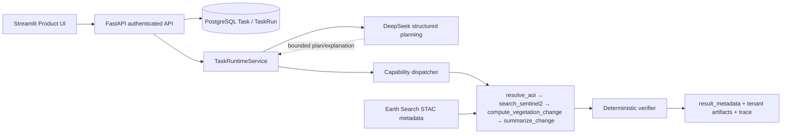

# TaskPilot / GeoChange Agent

TaskPilot is a multi-tenant task execution product that turns a bounded natural-language geospatial request into a traceable, verified result. The current vertical is **Wuhan East Lake multi-temporal vegetation-change analysis**: July 2023 versus July 2024, with NDVI metrics and three PNG artifacts.

## What it does

A user creates a Product Task, starts a run, and receives period evidence, NDVI-before/after/change images, decline statistics, a final explanation, and a persisted execution trace.

## Why an Agent here

A fixed script can compute NDVI. The Agent adds value at the boundary: it interprets a natural-language goal, emits a bounded structured plan, selects the four approved capabilities, and can request one evidence-dependent replan. Server-side deterministic code remains authoritative for authorization, lifecycle, AOI and STAC validation, raster mathematics, verification, and artifact access. This is a bounded workflow, not unlimited autonomy.

## Demo flow



## LLM versus deterministic authority

The LLM handles natural-language interpretation, bounded structured planning, and the final explanation. Deterministic/server code handles authentication, tenant isolation, task/run lifecycle, the Wuhan East Lake AOI catalog, STAC evidence validation, NDVI/statistics, the verifier, and persisted-reference artifact authorization. Numerical results are never model-authoritative.

## GeoChange workflow

The four capabilities are `resolve_aoi`, `search_sentinel2`, `compute_vegetation_change`, and `summarize_change`. A quality failure can trigger one bounded replan; the existing budget is then exhausted and the run becomes terminally failed.

## Evaluation

Batch C provides **MVP deterministic evaluation evidence** through:

```powershell
uv run python scripts/evaluation_geochange.py
```

The suite uses controlled arrays and no live provider or internet. It is not a production benchmark or scientific accuracy study. See [docs/EVALUATION.md](docs/EVALUATION.md).

## Current data mode

The supported demo mode is `CACHED_REAL_SENTINEL2_RASTER`: two small real Sentinel-2 B04/B08 crops are cached and provenance-bound; live STAC metadata may be queried for the same scenes, while the MVP does not download or process remote Sentinel raster/COG pixels per run.

## Security and multi-tenancy

Task and TaskRun reads are organization-scoped through a server-derived principal. Result metadata is bounded, and artifacts are served only from persisted tenant/run-scoped references. Paths, URLs, and model payloads do not grant authorization.

## Local demo

Follow [docs/DEVELOPER_GUIDE.md](docs/DEVELOPER_GUIDE.md) for setup, then use [docs/DEMO_GUIDE.md](docs/DEMO_GUIDE.md). Keep credentials in `.env` or hidden prompts; never copy tokens into documentation.

## Tests

```powershell
uv run pytest tests/geochange tests/evaluation tests/app -q
uv run ruff check src scripts
uv run pyrefly check
```

## Limitations

The current portfolio path uses process-local runtime dispatch, has no distributed worker or production exactly-once guarantee, supports one controlled AOI/use case, uses a local raster fixture, does not require remote COG processing, and is not production-scale geospatial infrastructure.

## Deferred roadmap

Future work may add durable worker execution, broader validated AOI coverage, and live raster pipelines after their contracts and security boundaries are designed.

The upstream reference README remains available as [README_UPSTREAM.md](README_UPSTREAM.md).
