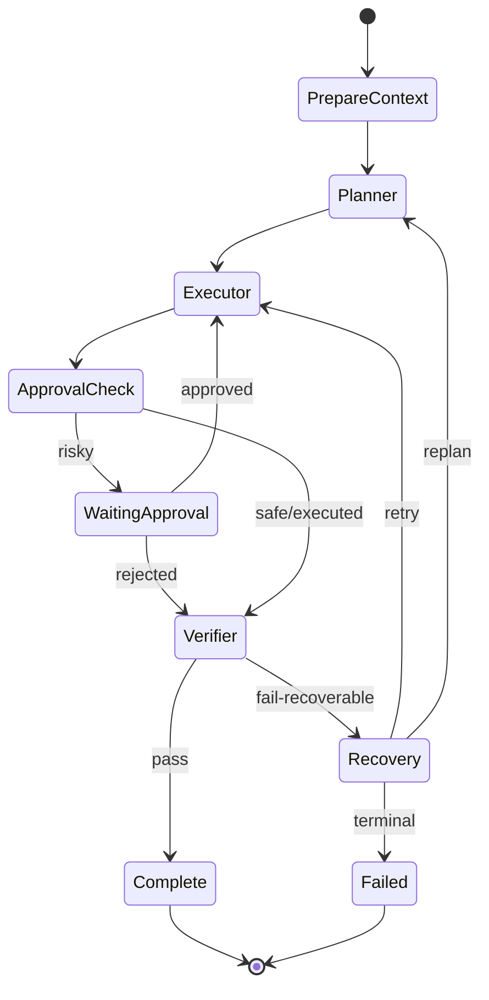

# Agent Runtime Design

## Minimal graph

## AgentState conceptual fields

- task_id
- task_run_id
- objective
- acceptance_criteria
- selected_skills
- plan[]
- current_step_index
- completed_steps[]
- failed_steps[]
- relevant_context
- tool_results[]
- retry_budget
- replan_budget
- pending_approval
- verification
- final_result
- terminal_error

Do not put full DB entities or unlimited conversation history into state unless required.

## Planner contract

Input:
- objective
- acceptance criteria
- selected context summary
- available skills/tools
- safety constraints

Output:
- ordered/structured steps
- expected output per step
- required skill/tool category
- verification hint

The plan must be machine-parseable.

## Executor contract

For one step:
- choose allowed skill/tool
- build typed args
- execute or propose risky action
- normalize result
- update step state

Executor should not silently change the user objective.

## Verifier contract

Output:
- verdict: PASS / FAIL / NEEDS_MORE_EVIDENCE
- criteria_results[]
- evidence references
- confidence if useful
- recommended recovery action

Verifier must be able to fail the result.

## Failure classes

- transient_tool_error → retry with backoff/budget
- invalid_tool_args → repair args then retry
- insufficient_context → retrieve context
- plan_invalid → replan
- approval_required → pause
- policy_blocked → terminal/rejected
- external_side_effect_unknown → pause for manual review; never blindly retry
- terminal_error → fail

## Retry budgets

Every loop must be bounded.
No unbounded agent recursion.

Record retries in persistent state/trace.

## Multi-agent rule

Planner/Executor/Verifier may be separate prompts/agents, but “multiple agents” is not a goal by itself.

Create additional agents only when:
- permissions differ
- context must be isolated
- independent verification matters
- model/tool specialization gives measured benefit
