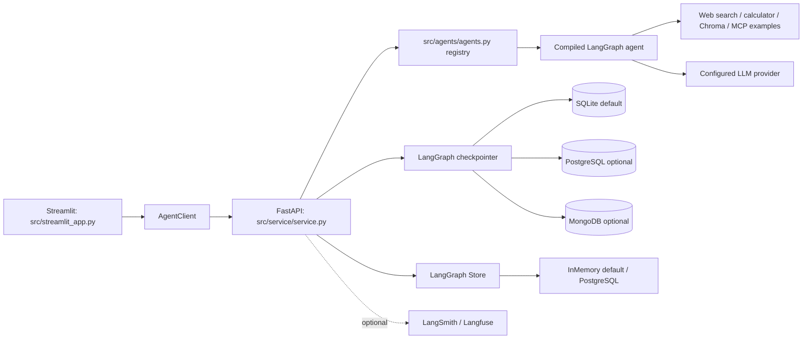

# Architecture — Phase 0 baseline (2026-09-10)

This document keeps the Phase 0/1 assessment below as history. The current implementation status is recorded in "Phase 2 identity architecture" at the end; earlier sections describe the runtime as it was when they were written.

## What is actually present now

This repository is an upstream `agent-service-toolkit` application: a LangGraph agent demo/service with FastAPI and a Streamlit chat UI. TaskPilot planning documents were added around it, but TaskPilot's product domain has not been implemented. The source of truth for this assessment is the code under `src/`, not the planning documents.

### Request flow

1. `src/run_service.py` loads `.env`, then starts Uvicorn with `service:app`.
2. `src/service/service.py` creates `app`; lifespan calls `memory.initialize_database()` and `initialize_store()`, assigns both to every registered graph, and lazy-loads the GitHub MCP graph.
3. `POST /invoke` or `POST /{agent_id}/invoke` validates `schema.UserInput`, selects a graph from `src/agents/agents.py`, and invokes it with LangGraph `thread_id`/caller-supplied-or-random `user_id`. `/stream` uses the same input construction and returns SSE; `/agui/*/run` provides AG-UI SSE.
4. The graph executes. For the default `research-assistant`, the path is input safeguard -> model -> optional `ToolNode` -> model -> end.
5. A checkpointer persists graph state by `thread_id`; `/history` and `/threads` read it. This is conversation persistence, not TaskPilot task/run/step storage.

### Request correlation

The FastAPI app installs one HTTP middleware for the complete request lifecycle. It
generates a fresh UUID4, stores it on `request.state.request_id` for downstream
handlers, and returns the same value in the `X-Request-ID` response header. Client
supplied `X-Request-ID` values are intentionally ignored, so callers cannot spoof a
server correlation value. This is request-scoped transport metadata only; it does
not create TaskPilot trace, run, task, or tool records. Structured logging and
redaction are deferred to T014.

`AUTH_SECRET` is a single optional shared bearer secret. It protects the router when set, but does not establish an authenticated user, organization, role, or tenant. `user_id` is request data and `/threads` documents that it is caller asserted; it must not be mistaken for TaskPilot authorization.

## Reusable upstream capabilities

| Capability | Real implementation | Reuse assessment |
| --- | --- | --- |
| FastAPI transport, JSON/SSE streaming, AG-UI | `src/service/service.py`, `src/service/agui.py`, `src/schema/schema.py` | Keep as transport starting point; add versioned TaskPilot APIs later. |
| Agent registry and lazy graph loading | `src/agents/agents.py`, `src/agents/lazy_agent.py`, `src/agents/github_mcp_agent/` | Keep registry pattern; do not treat demo graphs as TaskPilot roles. |
| LangGraph graph examples | research/RAG/interrupt/supervisor modules | Keep LangGraph; add a bounded TaskPilot graph only in Phase 4. |
| Checkpoint and long-term Store adapters | `src/memory/{__init__,sqlite,postgres,mongodb}.py` | Reuse adapters after deciding TaskPilot persistence boundaries. |
| Existing RAG examples | `src/agents/tools.py`, `rag_assistant.py`, `scripts/create_chroma_db.py`, `knowledge_base_agent.py` | Prototype only: no tenant filtering, provenance contract, or upload lifecycle. |
| Interrupt/resume primitive | `src/agents/interrupt_agent.py`, service `_handle_input` | Reuse technical primitive, not the birthdate demo; TaskPilot needs policy, approvals and exactly-once effects. |
| Tracing/feedback hooks | `src/service/service.py`, `src/service/agui.py` | Optional Langfuse callbacks/LangSmith feedback, not TaskPilot trace/audit truth. |
| Streamlit UI/client | `src/streamlit_app.py`, `src/client/client.py` | Keep for V1 development/demo; evolve after stable task APIs. |
| Tests and containers | `tests/`, `compose.yaml`, Dockerfiles, CI | Preserve; add deterministic TaskPilot tests phase by phase. |

## Persistence reality

- SQLite checkpoint: lightweight local-development checkpoint; the long-term store is process-local `InMemoryStore` and is not durable across restarts.
- PostgreSQL LangGraph persistence: `AsyncPostgresSaver` and `AsyncPostgresStore` create and upgrade library-managed checkpoint/Store schemas via `setup()`.
- MongoDB: optional checkpointer only (`docker/compose.mongo.yaml`); no Mongo Store.
- At the Phase 1 baseline there were no SQLAlchemy models, Alembic migrations, application business tables, or `Task`, `TaskRun`, `TaskStep`, user, organization, role, approval, trace-event or evaluation records. Phase 2 (T021–T023) added the identity tables `organizations`, `users`, `memberships`, and `auth_sessions`; T031 and T032 now add the persistence-only `tasks` and `task_runs` tables. `src/schema/task_data.py` remains Streamlit background-task display data, not the TaskPilot domain.

## Current feature inventory and TaskPilot V1 gap

| Requirement | Existing support / reusable code | Missing work and risk | Phase |
| --- | --- | --- | --- |
| Identity/RBAC/tenant isolation | Phase 2 implemented: `taskpilot` schema, opaque sessions, server-derived `CurrentPrincipal`, centralized authorization, tenant-scoped lookups, security matrix | Task create/list/get is implemented in T036; Task-owned mutation/run APIs and approval records remain missing | 2 (done) / 3 |
| Task/run/step lifecycle | T031/T032 persistence foundations plus T034 tenant-scoped Task/TaskRun repositories; FastAPI/Pydantic patterns | TaskStep schema, lifecycle transitions, cancellation, idempotency | 3 |
| Planner/executor/verifier/recovery | Demo tool-loop graphs; `StateGraph`, `ToolNode` | Typed state/plan/verdict, bounded retry/replan and acceptance verification | 4 |
| Checkpoint/resume | Conversation checkpoint plus interrupt demo; `memory/*` | Bind to authorized durable TaskRuns and recovery semantics | 4/6 |
| Skills/tools/context | Web/calculator, Chroma, Bedrock examples | Versioned contracts, tenant-safe retrieval, file lifecycle, budgets/provenance | 5 |
| Human approval | `interrupt()` demo | L0-L3 policy, approval records/APIs, audit/resume and exactly-once effects | 6 |
| Observability/audit | Logging, run UUID, optional Langfuse/LangSmith | Correlated TaskPilot IDs, sanitized events, metrics and audit truth | 7 |
| Evaluation | Unit/integration/smoke tests, fake model | Versioned deterministic task evals and safety/workflow metrics | 8 |
| Product UI | Streamlit chat, threads, voice/feedback | Login, tasks/runs/steps/traces/approvals/files; retain Streamlit first | 9 |

## Architecture delta and Phase 1 boundary

The smallest safe path is additive: preserve the upstream service, LangGraph, checkpointer adapters, Streamlit app and upstream reference files. Phase 1 should only make local development reproducible and establish conventions: audit `.env.example`, document verified commands, add request correlation middleware, add secret-safe structured logging in T014, and decide/verify a migration baseline for future TaskPilot tables. Do not add users, Task/TaskRun/TaskStep, Planner/Executor/Verifier, Redis/Kafka/Kubernetes, or a new frontend in Phase 1.

### Known unknowns

1. Verify in Phase 1 that LangGraph's Postgres tables can share the instance with future TaskPilot migration-managed tables.
2. The dependency-locked test/Docker baseline was not runnable on this host because `uv`, Docker and project dependencies are absent; reproduce after `uv sync --frozen` in a writable clone.
3. Decide in Phase 2 whether `AUTH_SECRET` remains a development-only compatibility mechanism; it is inadequate for end-user authorization.

## Phase 2 identity architecture (T021–T026 implemented)

ADR-004 freezes a PostgreSQL-only TaskPilot business schema in the `taskpilot` namespace, separate from LangGraph-owned tables. Identity is User + Organization + Membership, with one active membership bound to each opaque session. Authorization derives only from the server-resolved principal; upstream `AUTH_SECRET` and caller-supplied conversation IDs remain compatibility-only.

Bootstrap order is PostgreSQL, TaskPilot Alembic migrations, LangGraph saver/store `setup()`, then application startup. Production startup does not run migrations. SQLAlchemy 2.x async sessions are request-scoped, services own transactions, repositories do not commit, and ORM sessions never enter LangGraph `AgentState`. See ADR-004 and T021–T027 for implementation boundaries.

Implemented and reviewed:

- T021 provides `src/persistence/` with TaskPilot-owned SQLAlchemy metadata, an async psycopg engine/session factory, and the Organization repository. T034 adds tenant-scoped Task/TaskRun repositories; TaskRun queries derive tenant ownership through an explicit SQL join to Task. Alembic uses `migrations/env.py` and `taskpilot` schema version metadata; its `include_name` pre-reflection filter plus defensive `include_object` filter exclude public/LangGraph tables from autogenerate.
- T022/T022A/T023 add `users`, `memberships`, and `auth_sessions` through four linear revisions (`t021_organization`, `t022_user`, `t022a_membership`, `t023_auth_session`), with Argon2id password hashes, a canonical `normalized_email`, the frozen `owner|admin|member` role set, and SHA-256 session-token digests.
- T023 login issues opaque 24-hour sessions bound to one user and one membership, with generic credential failure and a controlled CLI bootstrap. T024 resolves the request-scoped `CurrentPrincipal` and re-reads all state per request. T025 provides the single authorization boundary with fixed 401/403/404 semantics. T026 supplies the authoritative negative security matrix.

Business persistence is enabled only by an explicit PostgreSQL `TASKPILOT_DATABASE_URL`; the existing `DATABASE_TYPE` remains the upstream LangGraph backend selector. Run `alembic upgrade head` as a release step, never from application startup.

Not implemented: TaskPilot login/`/me` endpoints, TaskStep records, planner/executor/verifier behavior, approval records, permission or role tables, JWT/refresh tokens, organization-switch endpoints, and TaskPilot observability tables. T031/T032/T034 provide Task and TaskRun persistence, T035 provides the explicit lifecycle service, and T036 provides tenant-safe Task create/list/get routes under `/api/v1/tasks`; Task mutation/run APIs and runtime remain later work. `tests/persistence` and the T026 security matrix need a disposable PostgreSQL test database and skip without one.
