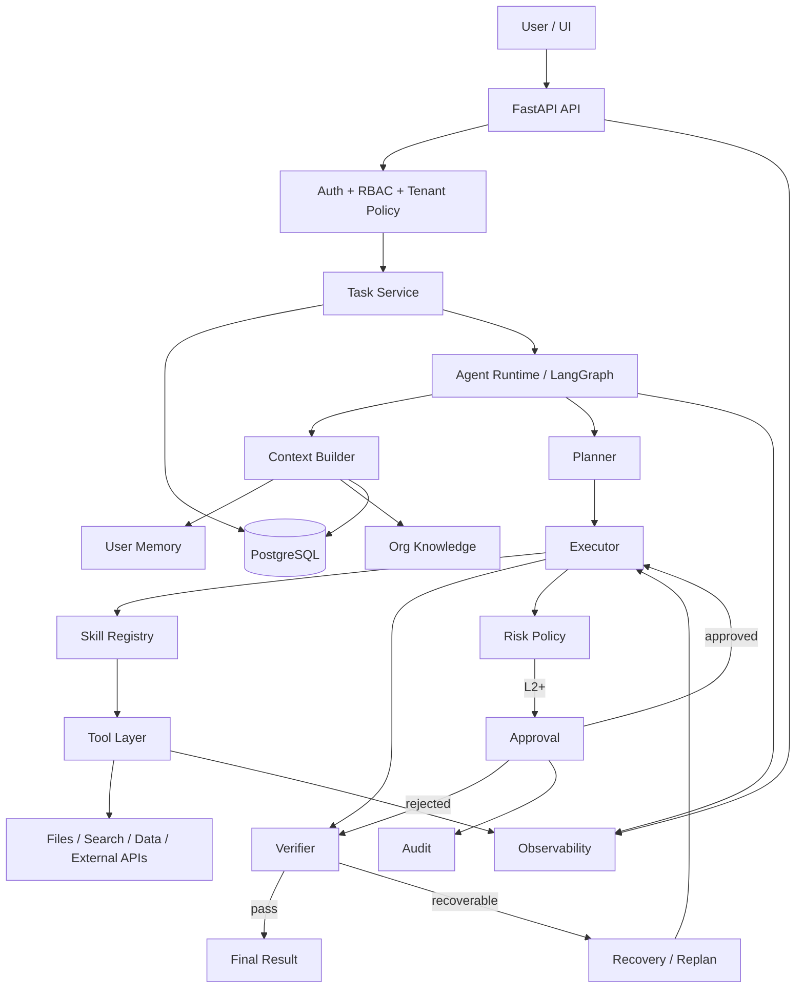
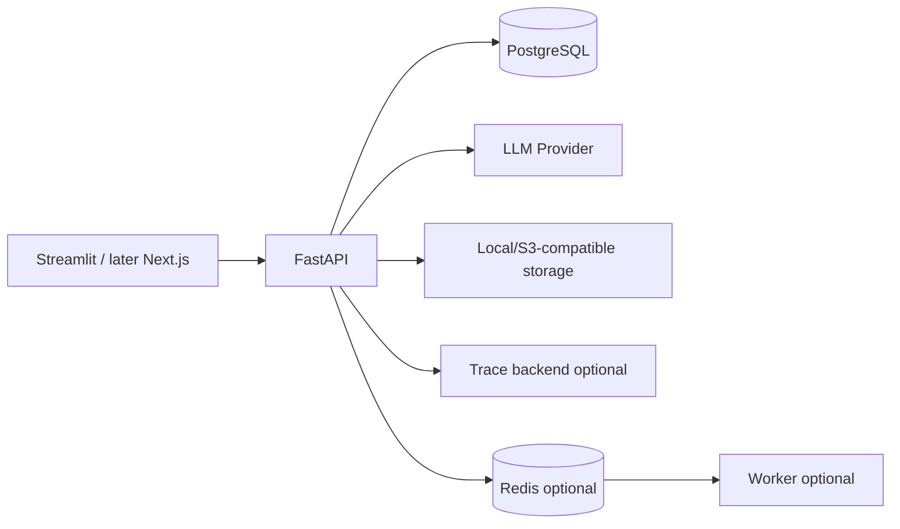

# Architecture

## Logical architecture

## Boundary principles

- API owns transport concerns.
- Auth/RBAC owns identity and authorization.
- Task service owns business task lifecycle.
- Agent runtime owns execution state machine, not user authorization.
- Skill registry owns reusable capability metadata.
- Tool layer owns deterministic external actions.
- Context builder owns what model calls receive.
- Approval service owns human decision persistence and authorization.
- Observability owns trace/metrics, not business decisions.

## Deployment, V1

Do not introduce worker/Redis until long-running concurrency behavior justifies it.

## Architecture invariants

1. Every persisted business resource belongs to a user or organization scope.
2. Every externally visible side effect has an idempotency mechanism.
3. Approval cannot be bypassed by calling a tool directly through an API route.
4. Agent state can be reconstructed enough to explain a run.
5. Verifier outputs structured reasons/evidence.
6. Trace is diagnostic; business truth lives in domain tables/state.
